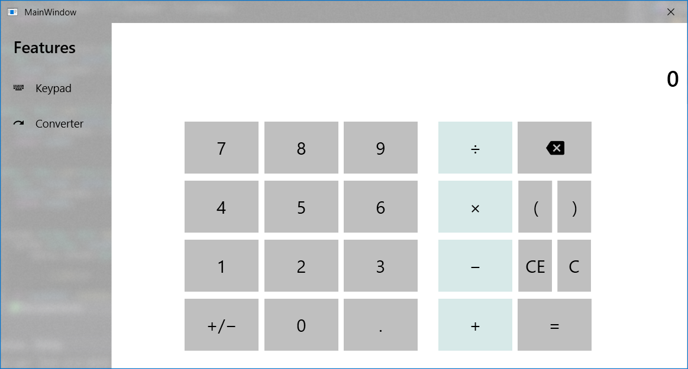

# Calculator

## Giới thiệu
- Là một chương trình tính toán với big numbers nguyên và có phần thập phân.
- Có 2 chức năng chính: Tính toán cơ bản và bộ chuyển đổi giữa các hệ thống số (Thập phân, Nhị phân, Thập lục phân)

## Chức năng
Có 2 tab chức năng chính: `Keypad` và `Converter`

### Keypad
Là phần dùng để tính toán cơ bản của chương trình. Bao gồm các phép tính cơ bản `+`, `-`, `*`, `/`. Được mô phỏng tương tự với chương trình Calculator mặc định của Microsoft Windows 10.

### Converter
Là phần dùng để chuyển đổi giữa các hệ thống số của chương trình. Bao gồm 3 hệ khả dụng là `Decimal` (Hệ thập phân), `Binary` (Hệ nhị phân) và `Hexadecimal` (Hệ thập lục phân). 

## Keypad

## Converter
