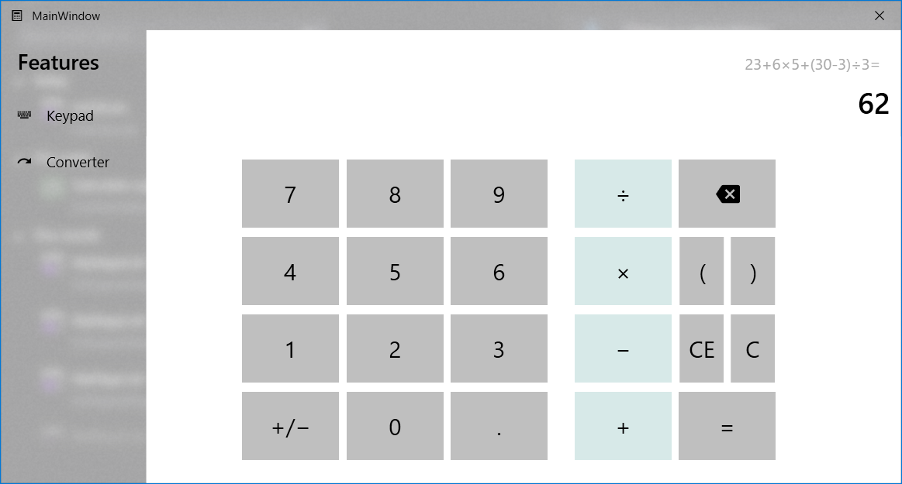

# Calculator

## Giới thiệu
- Là một chương trình tính toán với *big numbers* nguyên và có phần thập phân.
- Có 2 chức năng chính: Tính toán cơ bản và bộ chuyển đổi giữa các hệ cơ số.
- Giao diện *Fluent style* hiện đại, tương tự các ứng dụng mặc định của Microsoft Windows 10.
- Tương thích với hệ điều hành Microsoft Windows.

## Chức năng
Có 2 tab chức năng: `Keypad` và `Converter`

### Keypad
Là phần dùng để tính toán cơ bản của chương trình. Bao gồm các phép tính cơ bản `+`, `-`, `*`, `/`. Được mô phỏng tương tự với chương trình Calculator mặc định của Microsoft Windows 10 với khả năng tính toán *big numbers*.

### Converter
Là phần dùng để chuyển đổi giữa các hệ cơ số của chương trình. Bao gồm 3 hệ cơ số là `Decimal` (Hệ thập phân), `Binary` (Hệ nhị phân) và `Hexadecimal` (Hệ thập lục phân). 

## Keypad
Giao diện của tab Keypad với bố cục bảng số và dấu. Cho phép nhập chuỗi tính toán theo quy tắc toán học. Có thể nhận input từ bàn phím. 

## Converter
